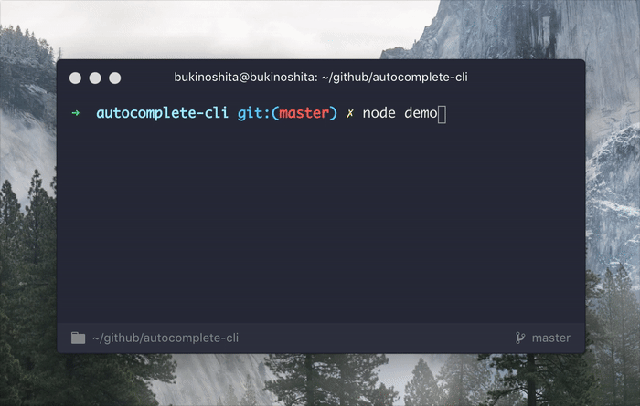

# autocomplete-cli [](https://travis-ci.org/bukinoshita/autocomplete-cli)

> Command line interface autocomplete


## Install

```bash
$ yarn add autocomplete-cli
```


## Usage

```js
const autoComplete = require('autocomplete-cli')

const start = '> Choose a band: '
const suggestions = new Set(['blink-182', 'green day', '+44'])

await autoComplete({ start, suggestions })
```


## Demo




## Related

- [prompt-email](https://github.com/bukinoshita/prompt-email) — Command line interface prompt email with autocompletion, validation and email lookup


## License

MIT © [Bu Kinoshita](https://bukinoshita.io)
